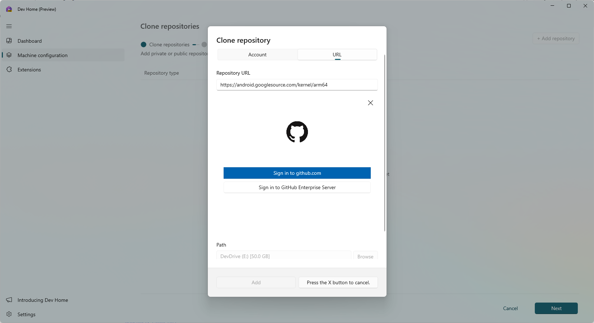
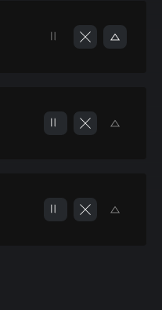
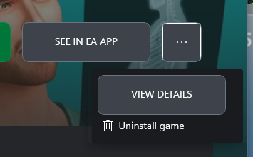
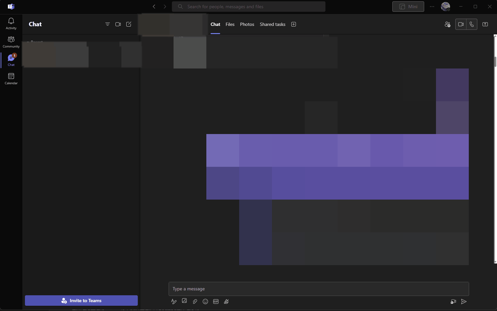
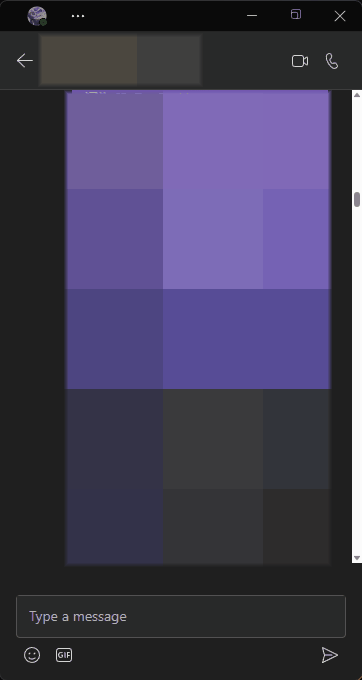

# Microsoft 垃圾产品质量 / BUG 集锦

> "The only problem with Microsoft is they just have no taste" - Steve Jobs
>
> "微软的问题就在于他们没有品位" - 乔布斯

## Dev Home 无法克隆除 GitHub 以外需要授权的 Repository

这个程序无法使用 SSH 的方式对仓库进行克隆，因此部分企业中强制要求进行 SSH Clone 方式的仓库均无法使用。

不仅如此，还有很多需要验证的，GitHub 之外的仓库。Dev Home 最终在克隆的时候都让你登录 GitHub，然后显示你没有该仓库的权限。

超级差的体验

## Xbox 下载页面暂停按钮图标位移

又是位移

## Xbox 的奇妙按钮排版设计

好丑，微软没有任何美感的傻逼设计师真把自己当设计师了

## Microsoft Teams 图片 icon 出现位移

## Microsoft Teams 切换标签页失效 & 文件标签页随机出现无文件情况

从文件切换到聊天很可能切换不过来。并且随机出现文件列表显示为空的情况

## Microsoft Teams 无法关闭 Mini 窗口

如标题，无法关闭 Mini 窗口。（首次打开 Teams 可以关闭 Mini 窗口，后面就无法关闭了，只能通过任务栏将该窗口关闭）

## Windows 切换 Desktop 时就可以触发 Taskbar 的软件 Icon 随机消失的问题

太他妈傻逼了微软

## Windows 自带的 Emoji 输入功能有许多 Unicode 字符残缺

虽然我知道 Windows 的 Emoji 无法输入旗帜类型的 Emoji。但是我今天在找中指 Emoji 的时候我也找不到。

Windows 你的 Emoji 输入有个鸡巴用 😁

Windows:

Apple:

## Microsoft Account Passkeys 后续: 不，微软不支持 Passkeys

实测移动设备上根本无法使用密钥 (Passkeys) 方式登录，这也说明了为什么 Microsoft Account 在设置 Passkeys 时没有明显标识。

## Microsoft Account ~~支持 Passkeys 但没有明确标识~~ 不支持 Passkeys

虽然理论上走的 FIDO 标准没错但是谁会想到藏到这种地方啊...

右下角版权时间写的 2020 BTW，这破页面也有 3 年没更新了。麻烦傻逼微软更进一下好吗？

## [Microsoft Edge 卡死](https://github.com/JimmyRice/fuck-microsoft/pull/3) by [Arispex](https://github.com/Arispex)

突然卡死，退出重开无效

## [Windows 任务管理器显示异常](https://github.com/JimmyRice/fuck-microsoft/pull/3) by [Arispex](https://github.com/Arispex)

## Microsoft Loop 傻逼级别的机翻

当微软对 Bing Translate 给予了大量信心而直接让所有项目的多语言化直接变成自动流水线后:

"动作英雄"

"不良的构想脑力激荡"

**更傻逼的是我找不到调整语言的地方，你翻译成这样，倒是让我调回英文阿？**
**微软你妈死了捏**

同期加映: [微软式中文，那些令人啼笑皆非的经典句子](https://www.dians.net/thread-925.htm)

## Windows Weather, 新老 Fluent Design 的强力撞击视觉盛宴

红色区域为 Windows 10 时代的 Fluent Design 组件

蓝色区域目测可能套了 WebView 2，采用新版本的 Fluent Design 的网页

微软没品设计直接带来了两个时代的 Fluent Design 的撞击视觉盛宴

## Windows Tools 黑白无常

## 硬盘不识别，重启后恢复 - (?)

一个一次性问题，将一个 Samsung 的移动硬盘插入后 Windows 没有反应。重启解决

在重启 Windows 前插入到 iPadOS 中读取无障碍

移动硬盘的文件系统为 exFAT

这鸡巴稳定性随便拿一个国产套皮系统都可以把 Windows 这个 fw 压在地上狂揍吧 😅

## Widget Badge 错位

## 控制中心图标异常

## [Windows 开始菜单中软件图标消失](https://github.com/JimmyRice/fuck-microsoft/pull/2) by [Seamain](https://github.com/Seamain)

## Windows 开始菜单启动程序后无法自动消失

## [Windows 空间计算错误](https://github.com/JimmyRice/fuck-microsoft/issues/1) by [Arispex](https://github.com/Arispex)

## Windows 11 Select an App 的程序选择卡死

啊？这都能卡死...

## Windows 11 从休眠中恢复 Taskbar 图标失踪

随机复现，很他妈烦人。解决方案强制重启 Explorer.exe

## Windows 11 Print Preview 似乎只支持 UWP - (?)

微软亲儿子画图程序 Paint.exe 都必须把 Paint Preview 做成一个独立功能

目前测试情况: 我能测试的非 WebView / Chromium 的 Windows 窗体程序在新版打印窗口中均没有打印预览

## Azure 前端 Bug

虽然不是太大的问题，但是写出这种玩意也是蛮牛逼的

在 Chrome 和 Edge 都复现成功

## Bing 前端 Bug

似乎已经修复，有一小段时间了。偶然发现 New Bing 生成的答案，下面的来源框中。href 是这么写的...导致跳转过去是 Bing 404。十分佩服微软

## Windows Theme 保存预览为全黑色，只能按照名字分辨

我很不解为什么微软要这么做。

## Windows Copilot Preview 临时问题，无法复现宣传功能

未知原因，无法打开程序也无法调整任何设定。但是后面又自己恢复了

一样，这个 Windows Copilot 也是 New Bing 做的，WebView 2 套壳 (也许，总之是网页就是)。没有任何诚意的产品。

## Windows Explorer 添加到快速访问 Bug

我只是 Pin 了一个，结果所有都 Pin 上了是？

## Windows Explorer 从快速访问移除 Bug

我移除了一个文件夹，自动把我的 Tom Clancy's Rainbow Six Siege 文件夹 Pin 上干嘛？？

## Windows 11 消息自动聚焦

我的 QQ，微信，Discord 偶尔会复现这个情况。出现这个情况的时候非常烦人，写代码写到一半突然被切出编辑器

刚开始以为是我个人的问题，Google 后发现碰上的人不少
